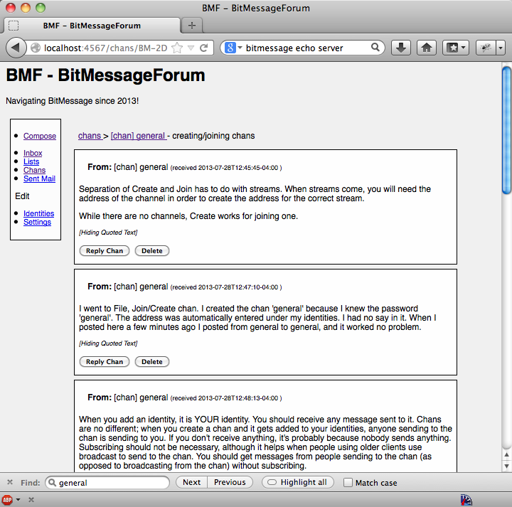

<table>
<tr>
<td> View Channel</td>
<td> Read Thread</td>
</tr>
</table>

# BMF

BitMessageForum allows you to browse and post bitmessages in a
forum-like view in the web browser of your choice.

Although BMF is configured to run in your browser, it is designed to
be a local application.  it assumes that if you can talk to your
bitmessage server, you are fully authorized to read/send/delete any
messages, create new identities, etc.

It is **not** designed to be setup as a publically facing website.
Although it would be possible to use the software to mirror a channel
via a web interface, this would break the self-destruct feature that
removes bitmessages from the network after a few days. So please don't
do that!

## Installation

### Prerequisites

#### Software

The following software is required:

* [Ruby](http://www.ruby-lang.org/en/)
* Ruby development toolchain.  `apt-get install ruby-dev` on Debian-based platforms.
* [PyBitmessage](https://bitmessage.org/wiki/Main_Page)

#### PyBitmessage API configuration

To enable the API for PyBitmessage you must add the following to
the `[bitmessagesettings]` section of keys.dat:

    apienabled = true
    apiport = 8442
    apiinterface = 127.0.0.1
    apiusername = bmf
    apipassword = bmf

### Initial installation

    sudo gem install bmf

### Running the software

    bmf

If you are using different settings for the PyBitmessage server, you
will need to change that on the [settings
page](http://localhost:4567/settings/) or by manually editing
`config/settings.yml`.

### Developers. Run from the source:

### Prerequisites

* a ruby installation capable of building binary extensions. 

* bundler.

Most ruby developers use a tool like [rvm](https://rvm.io/) or
[chruby](https://github.com/postmodern/chruby) to maintain per-user
and per-project versions of ruby.  This prevents you installing dozens
(or possibly hundreds) of ruby gems with arbitrary code system-wide.
It is recommended that you use one of these tools.  After that,
install bundler in the local gemset:

    gem install bundler

If you just want to get things up and running quickly, you
can install ruby and bundler system-wide:

On Debian based systems:

    sudo apt-get install ruby-dev
    sudo gem install bundler

### Cloning the source and configuring

    git clone https://github.com/grant-olson/BitMessageForum.git
    cd BitMessageForum
    gem install bundler
    bundle install # will need sudo if using system ruby
    ./bmf-dev

### Running PyBitmessage as a daemon

If you find yourself using BMF all the time and don't want to see the
PyBitmessage UI, you can start PyBitmessage as a daemon.

First, add the following to the `[bitmessagesettings]` section of `keys.dat`:

    daemon = true

Next, start PyBitmessage like so:

    nohup python src/bitmessagemain.py &

This will start up PyBitmessage in the background without the QT GUI.

## Contact

Found a bug? [File an issue.](https://github.com/grant-olson/BitMessageForum/issues)

Need help?  Ask on the bmf support channel.

    * Name: bmf_support
    
    * Address: BM-2DBsnPXWVR7PbC5qMEYAdgtaSQnkr5X7ng 

For announcements of new releases and security issues, subscribe to BM-2DABVRoCRtwKZLyVCBZ3n6PuC4n7a4zLsA

Or send me a personal bitmessage: BM-2DAxhHpd2Sez4oQmZu5sEAMJbnNp3yDFCU 

Email me:  kgo at grant-olson dot net.

OpenPGP Key:

    pub   2048R/E3B5806F 2010-01-11 [expires: 2014-01-03]
          Key fingerprint = A530 C31C D762 0D26 E2BA  C384 B6F6 FFD0 E3B5 806F
    uid                  Grant T. Olson (Personal email) <kgo at grant-olson dot net>
    sub   2048R/6A8F7CF6 2010-01-11 [expires: 2014-01-03]
    sub   2048R/A18A54D6 2010-03-01 [expires: 2014-01-03]
    sub   2048R/D53982CE 2010-08-31 [expires: 2014-01-03]
